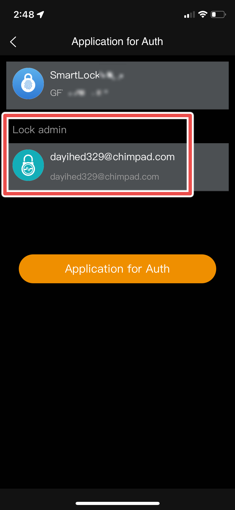

# CVE-2022-45634: Username Disclosure Vulnerability in DBD+ Application Used by Megafeis Smart Locks

## The Issue

While exploring the DBD+ application's functionality, I learned that simply attempting to connect to a lock which is already bound to an existing user's account will reveal that user's email address or phone number. This can be classified as an information disclosure issue and while the vulnerability itself is not a critical risk, it can be chained with [CVE-2022-45637](/CVE-2022-45637) or [CVE-2022-45635](/CVE-2022-45635) to facilitate an attacker's enumeration efforts to hijack legitimate users' accounts. 

To demonstrate an attacker's ability to expose sensitive user information such as emails or phone numbers which could be used in account takeover attacks, I have shown screenshots of sample user data being exposed.

## Proof-of-Concept

### Pre-Requisites
- Valid DBD+ account
- Installed DBD+ application

### Demo
To find the email or phone number of a target lock's owner, log in to the DBD+ application using a valid account (which you have created for testing purposes). Once authenticated, find and press the "Add" button. This will enumerate a list of bluetooth low-energy (BLE) devices in the immediate vicinity. Once a device advertising its MEGAFEIS model number is discovered, tap on it. The resulting permission request will expose its owner's login username which can be leveraged for further access as shown in [CVE-2022-45637](/CVE-2022-45637) or [CVE-2022-45635](/CVE-2022-45635). 

