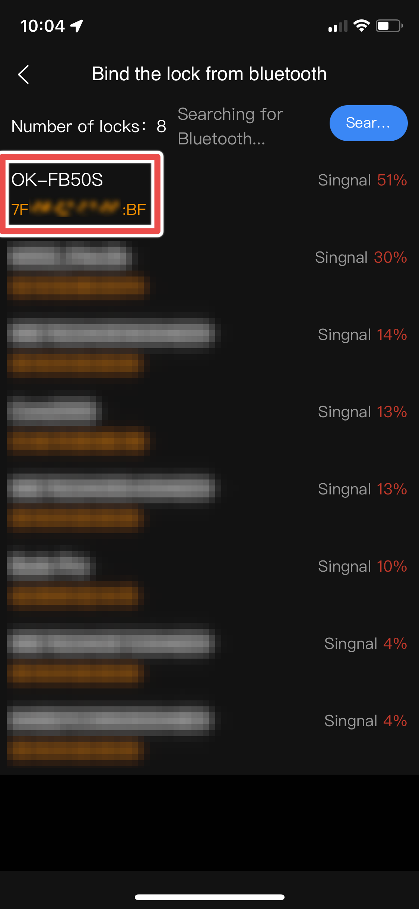
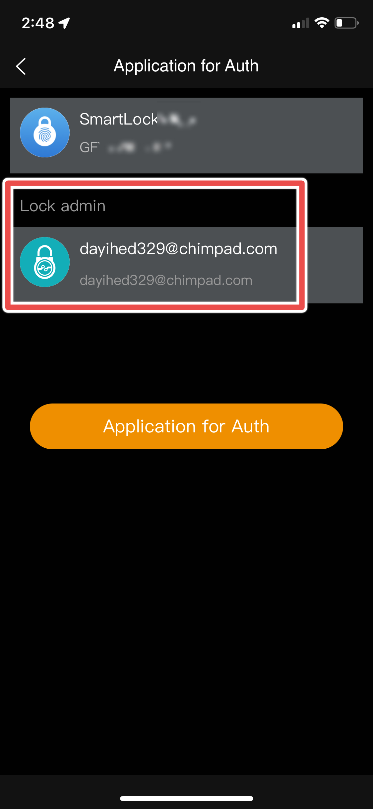
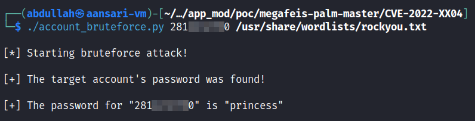

# CVE-2022-45635: Insecure Password Policy & Lack of Rate Limiting

## The Issue
While attempting to create accounts on the DBD+ application for testing purposes, I found that the enforced password policy was incredibly insecure. The app allowed users to create passwords which were as low as 4 characters long and did not enforce the inclusion of special characters, numbers, or upper-case letters. This, combined with the fact that the API which handles authentication requests isn't rate limited creates the possibility for an attacker to conduct a dictionary attack against a target user.

As discussed in [CVE-2022-45636](/CVE-2022-45636), since the lock-management API verifies request authenticity with an easily forgeable signing key, an attacker with the ability to create signing keys could simply cycle through a list of likely passwords and eventually correctly guess a legitimate user's password thereby enabling the tampering of locks belonging to that account.

To demonstrate an attacker's ability to perform successful password-guessing attacks on users resulting in account takeovers, I have developed a PoC which automates this process. The only piece of required information is the target user's email address or phone number, which can be trivially acquired by chaining the information disclosure vulnerability discussed in [CVE-2022-45634](/CVE-2022-45634).

## Proof-of-Concept

### Pre-Requisites

- Installed DBD+ app (for exploitation of [CVE-2022-45634](/CVE-2022-45634)) 
- Valid target DBD+ account username or phone number
- CVE-2022-45635_PoC.py - ```git clone https://github.com/shehzade/megafeis-palm.git```
- Script dependencies - ```pip3 install -r requirements.txt```

### Usage

```
Usage: python3 CVE-2022-45635_PoC.py <target_username> <wordlist>
```

Example: ```python3 CVE-2022-45635_PoC.py 28112345670 /wordlist/rockyou.txt```

### Demo

#### Step 1: Discover a MEGAFEIS Smart Lock's Administrator

To find the email or phone number of a target lock's owner, we will use the information disclosure vulnerability discussed in [CVE-2022-45634](/CVE-2022-45634). Open the DBD+ app and tap the "Add" button. Once a lock advertising its model number is found, tap on it and the application should prompt you to ask for unlock access from the administrator. Requesting access is unnecessary, but be sure to record the email address or phone number as it is required in the next step.



#### Step 2: Perform Account Takeover

Once you have the target account's email address or phone number, download the PoC script and install the dependencies. Now execute the script with the correct arguments as shown below.



Once the account password is discovered, you should be able to log in to the target account and unlock any devices belonging to it.