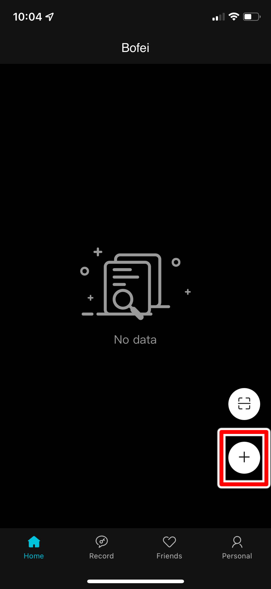
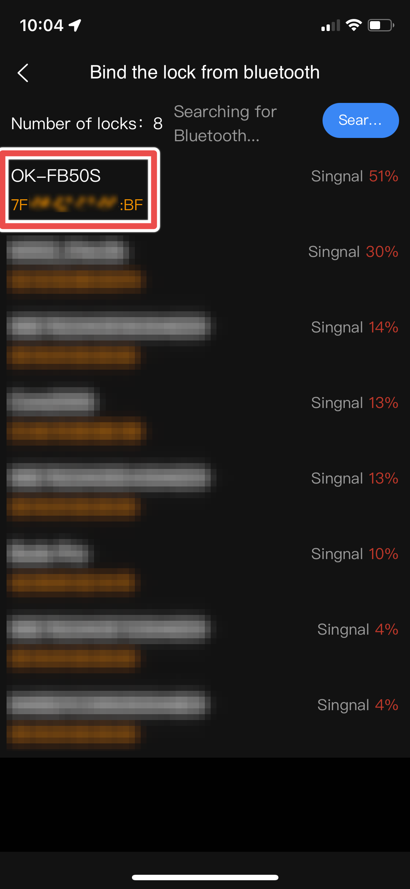

# CVE-2022-45636: Insecure Authorization Scheme for API Requests in DBD+ Mobile Companion Application for Megafeis Smart Locks

## The Issue
While analyzing the back-end HTTP requests made by the mobile app to the central lock-management API, I noticed that the server was validating requests solely with the value of a custom HTTP header called ```SecSignDest```. The included ```connect.sid``` cookie and the ```token``` header, although being verified for authentication, were not being checked to confirm that the user the token or cookie belonged to, was actually authorized to perform the action being requested.

Furthermore, decompiling the android application and reverse engineering the generation of the ```SecSignDest``` HTTP header led to the discovery that its value was simply an MD5 hash derived from a fingerprint string, a custom date string, a portion of the HTTP request data, and the API endpoint to which the data was being sent. This meant that anyone who could create these signing keys, could forge requests to the API, and since there were no authorization checks in place, perform arbitrary actions on other users' accounts.

Additionally, all the data needed to construct the signing key for the ```SecSignDest``` HTTP header was readily available in the application source code (for the fixed portions) and the HTTP request being sent (for the dynamic portions).

To demonstrate an attacker's ability to perform arbitrary actions on other users' accounts and locks, I have developed a PoC which disconnects a MEGAFEIS smart lock from its legitimate owner, transfers it to the account of a malicious 3rd party, and offers the option to return it to the original account after the lock has been opened. This is achieved solely with the bluetooth MAC address (bd_addr) of the smart lock (which is trivial to discover) and the credentials to a malicious account which can be created easily.

## Proof-of-Concept

### Pre-Requisites
- Target lock's bluetooth MAC address (bd_addr)
- Installed DBD+ application
- Valid DBD+ account
- CVE-2022-45636_PoC.py - ```git clone https://github.com/WithSecureLabs/megafeis-palm.git```
- Script dependencies - ```pip3 install -r requirements.txt```

### Usage

```
python3 CVE-2022-45636_PoC.py <bd_addr> <attacker_email/phone>
```

Example: ```python3 CVE-2022-45636_PoC.py 7F:06:07:03:0E:CF test@test.com```

### Demo

#### Step 1: Find a MEGAFEIS Smart Lock

To find a target lock, open the DBD+ app and tap the "Add" button. Once a lock advertising its model number is found, record its bluetooth MAC address as it will be needed later on.



#### Step 2: Perform Lock Takeover

By this stage, you should have installed and created an account on the DBD+ application. Once you have both the lock's MAC address and your account ready, run the script with the correct arguments. 

The attack scenario below shows a MEGAFEIS lock bound to a legitimate user's account (dayihed329@chimpad.com). Also shown is an attacker account (diyoveh601@5k2u.com) ready to steal it.


Once the script is downloaded and the dependencies installed, execute it as shown below.


Once the lock takeover is complete, you should be able to log in to the attacker account and unlock the smart lock. You may also return it to the original owner to avoid suspicion once you have accomplished your objective (for which I bear no responsibility).


