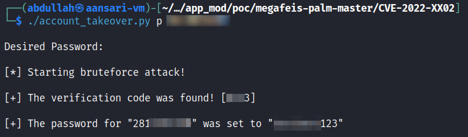

# CVE-2022-45637: Insecure Password Reset Code Expiry Mechanism for Megafeis Smart Locks

## The Issue
During testing of the DBD+ application's functionality, I discovered that the app did not expire password reset codes after 60 seconds as it was indicating on the UI. I also noticed that there was no rate-limiting on password reset requests with incorrect verification codes. These two flaws in the password reset mechanism could allow attackers to initiate password resets on target accounts and bruteforce the verification code until a successful reset is achieved.

As discussed in [CVE-2022-45636](/CVE-2022-45636), since the lock-management API handles all user account operations and verifies request authenticity with an easily forgeable signing key, an attacker with the ability to create signing keys could simply cycle through a list of possible verification codes and eventually change a legitimate user's password to an attacker-known value.

To demonstrate an attacker's ability to perform successful bruteforce attacks on other users resulting in account takeovers, I have developed a PoC which automates this process. The only piece of required information is the target user's email address or phone number, which can be trivially acquired by chaining the information disclosure vulnerability discussed in [CVE-2022-45634](/CVE-2022-45634).

## Proof-of-Concept

### Pre-Requisites

- Installed DBD+ app (for exploitation of [CVE-2022-45634](/CVE-2022-45634)) 
- Valid target DBD+ account username or phone number
- CVE-2022-45637_PoC.py - ```git clone https://github.com/WithSecureLabs/megafeis-palm.git```
- Script dependencies - ```pip3 install -r requirements.txt```

### Usage

```
Usage: python3 CVE-2022-45637_PoC.py <p (phone number) or e (email address)> <victim_email/phone>
```

Phone Number Example: ```python3 CVE-2022-45637_PoC.py p 28112345670```

Email Address Example: ```python3 CVE-2022-45637_PoC.py e target@test.com```

### Demo

#### Step 1: Discover a MEGAFEIS Smart Lock's Administrator

To find the email address or phone number of a target lock's owner, we will use the information disclosure vulnerability discussed in [CVE-2022-45634](/CVE-2022-45634). Open the DBD+ app and tap the "Add" button. Once a lock advertising its model number is found, tap on it and the application should prompt you to ask for unlock access from the lock's administrator. Requesting access is unnecessary, but be sure to record the email address or phone number as it will be needed in the next step.


#### Step 2: Perform Account Takeover

Once you have the target account's email address or phone number, download the PoC script and install the dependencies. Now execute the script with the correct arguments as shown below. Be sure to input a **4+ character password** when the script prompts you for it.



Once the account takeover is complete, you should be able to log in to the target account with the password you specified during execution. 
